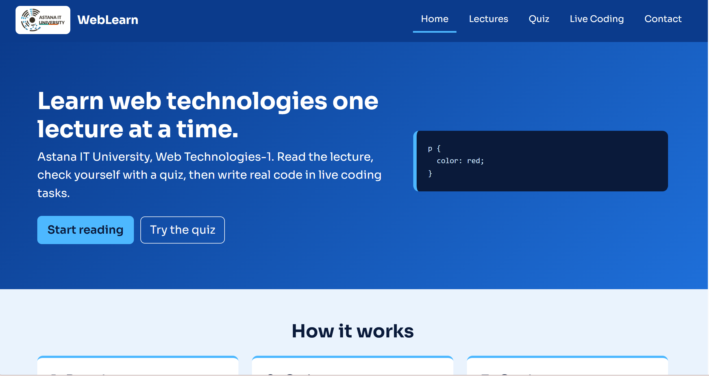
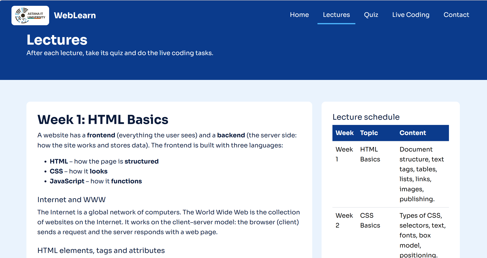
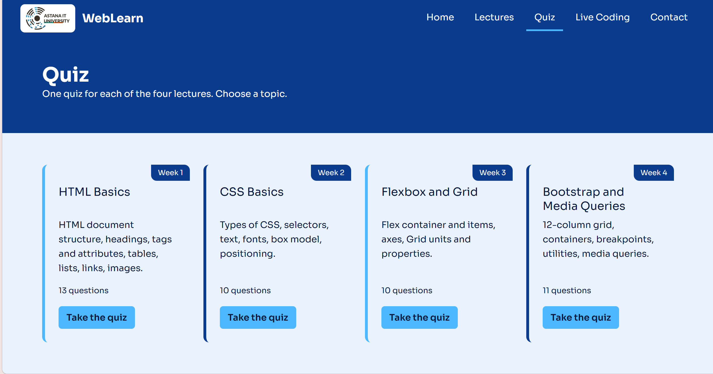
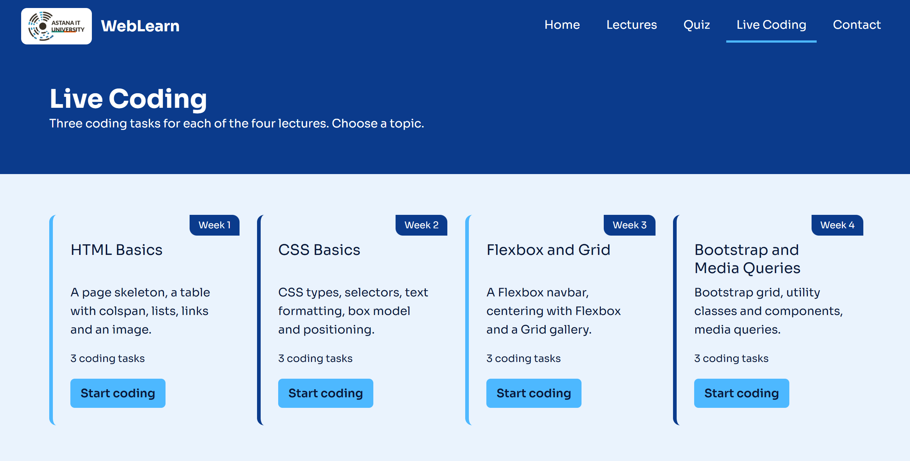
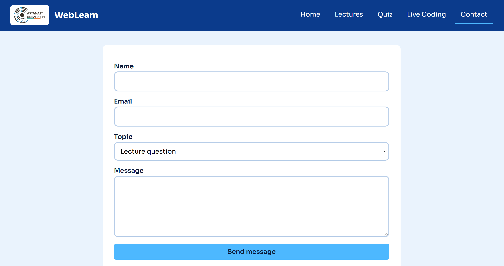
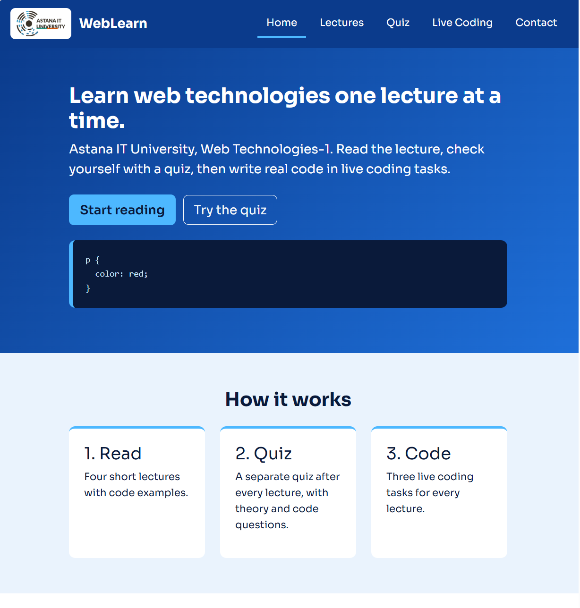

# WebLearn: Online Courses Website

## Project title and topic

WebLearn is a small online course website for Web Technologies-1. The student reads a lecture, takes a quiz on it and then does three live coding tasks, all on one site.

## Group members

- Aidana Muratova
- Zhasmira Mamyrbayeva
- Khanzada Nyshanbek

## Short description

The site has the lectures of the first four weeks:

- Week 1: HTML Basics
- Week 2: CSS Basics
- Week 3: Flexbox and Grid
- Week 4: Bootstrap and Media Queries

Every week works the same way. The student reads the lecture, presses "Take the quiz", and then presses "Live coding". Both buttons are at the end of each lecture. In total the site has 14 pages, 44 quiz questions and 12 live coding tasks.
## Screenshots

Home page:

Lectures page:

Quiz after pressing "Check Answers":

.png)

Live coding task with the solution opened:

.png)

Contact page:

Mobile version with the hamburger menu:

## Project structure

- index.html: Home page
- lectures.html: all four lectures and the lecture schedule table
- quiz.html: quiz hub
- quiz-week1.html, quiz-week2.html, quiz-week3.html, quiz-week4.html: one quiz per lecture
- live-coding.html: live coding hub
- live-coding-week1.html, live-coding-week2.html, live-coding-week3.html, live-coding-week4.html: three tasks per lecture
- contact.html: contact form
- thank-you.html: confirmation page after the form
- css/style.css: the only stylesheet of the project
- img/aitu-logo.png: university logo
- README.md: this file

## What we did in this project

- Built the whole site from scratch with HTML5 and CSS3: 14 pages that share the same header and footer.
- Made the header with the logo and a Flexbox navigation. The current page is highlighted in the menu, and the header stays at the top with `position: sticky`.
- Made a hamburger menu for small screens. It uses a hidden checkbox and CSS only, no JavaScript.
- Wrote the content of the four lectures on one page, with code examples and tables (tags, selectors, positioning, Flexbox properties) and a lecture schedule table.
- Wrote 4 quizzes, one for each lecture, with theory and code questions. Each question has three options and an explanation.
- Made the "Check Answers" button work without JavaScript. A hidden checkbox is placed at the top of the form, and when it is checked the sibling selectors `~` and `+` paint the correct answer green, the wrong choice red, and show the explanation. "Try again" is a normal `reset` button.
- Made 12 live coding tasks, 3 for each lecture. Each task has requirements, an expected result, a box for your own code and a "Show Solution" button that uses the same checkbox trick.
- Added "Take the quiz" and "Live coding" buttons at the end of every lecture so the student goes straight to the right page.
- Made the contact form with `required` fields and an email field. The form sends the student to `thank-you.html`.
- Wrote our own `css/style.css` with CSS variables for colors, font and radius, Flexbox, Grid, positioning, `:hover`, `:focus`, `:focus-visible` and `:nth-child()`.
- Connected Bootstrap 5.3.3 for the 12-column grid, buttons, tables and utility classes.
- Made the site responsive with Bootstrap classes and our own media queries at 992px, 768px and 576px.
- Connected the Google Font Sora, added `alt` text to images and `loading="lazy"` to images below the fold.
- Published the website on GitHub Pages.

## Features implemented

- Header with logo and Flexbox navigation, footer with contacts, copyright and social links on every page
- Hamburger menu on small screens
- Semantic HTML5, tables and forms
- External CSS with variables, Flexbox, Grid, positioning and pseudo-classes
- Responsive design with Bootstrap and media queries
- Quizzes with answer checking and explanations
- Live coding tasks with solutions
- Contact form with a confirmation page

## Technologies used

- HTML5
- CSS3
- Bootstrap 5.3.3 (from the jsDelivr CDN)
- Google Fonts (Sora)
- GitHub Pages

## How to run

Download or clone the repository and open index.html" in a browser. Nothing needs to be installed. Bootstrap and the font are loaded from the internet, so you need a connection to see the site exactly as designed.

## Individual contributions

- Aidana Muratova: Lectures page (lecture content and schedule table), Contact page, media queries and hamburger menu
- Zhasmira Mamyrbayeva: Quiz and Live Coding pages, forms, Bootstrap classes
- Khanzada Nyshanbek: project structure, Home page, header and footer, main "css/style.css" (variables, Flexbox, Grid), publishing the website

## Limitations

- The site has no JavaScript, so quiz answers are only checked visually. There is no score and nothing is saved.
- The contact form does not send a real email. The footer email and social links are placeholders.
## Published website
https://muratovaajdana201-ctrl.github.io/wenlearn-midtermmm/
